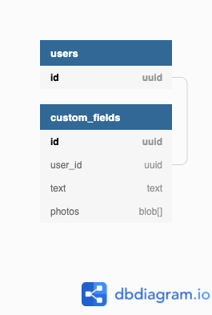

# Spec: Property "Custom Fields"

## Summary
Our activations teams frequently need to track semi-structured data (typically free text and
accompanying photos) and have requested a product that allows management to build custom
forms for teams on the ground.

## Scope
The scope of this property is currently limited to the activations teams. In the future,
this property may be standardized across all teams.

## Modeling
Available at [dbdiagram.io](https://dbdiagram.io/embed/61a013348c901501c0d32666)

```
/// a user is a member of the
/// activation team
Table users {
  id uuid [pk]
}

Table custom_fields {
  id uuid [pk]
  user_id uuid
  text text
  photos blob[]
}

Ref: users.id < custom_fields.user_id
```



## API
```
POST /activations/custom_fields
Body:
{
    "user_id": uuid,
    "text": string,
    "photos": [binary]
}

Returns:
{
    "id": uuid
}

GET /activations/custom_fields/{id}
DELETE /activations/custom_fields/{id}
PATCH /activations/custom_fields/{id}
```
